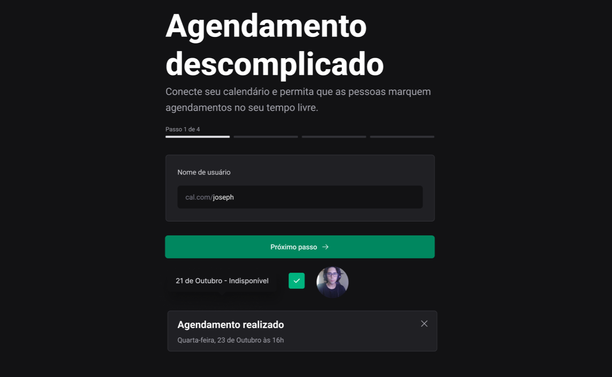

<div align="center">
  <h1> Design System </h1>
</div> 

<h2 align="center">Link to components: <a href="https://diaspd.github.io/design-system-ignite" target="_blank">Design System Ignite</a> </h2>

<h2 align="center">
  NPM: 
  <table align="center">
    <tr> <a href="https://www.npmjs.com/package/@ignite-ui-/react" target="_blank">@ignite-ui-/react</a> </tr> &nbsp;
    <tr valign="top"><a href="https://www.npmjs.com/package/@ignite-ui-/tokens" target="_blank">@ignite-ui-/tokens</a></tr> &nbsp;
    <tr valign="top"><a href="https://www.npmjs.com/package/@ignite-ui-/docs" target="_blank">@ignite-ui-/docs</a></tr>
  </table>
</h2>

<div align="center">
  <b>
    <a href="#-Technologies"><b>Technologies</b></a>&nbsp;&nbsp;&nbsp;|&nbsp;&nbsp;&nbsp;
    <a href="#-Project"><b>Project</b></a>&nbsp;&nbsp;&nbsp;|&nbsp;&nbsp;&nbsp;
    <a href="#-Layout"><b>Layout</b></a>&nbsp;&nbsp;&nbsp;
  </b>  
</div>

---

<div align="center">
  
</div> 

</br>

## 🚀 Getting started

Clone the project and access the folder.

```bash
$ git clone https://github.com/diaspd/design-system-ignite.git
$ cd 
```

## Installation

```bash
$ npm install
```

## Running the app

```bash
$ npm run dev
```

The app will be available on `http://localhost:`

<br></br>

## 💻 Technologies

This project was developed with the following technologies:
<b>
- Storybook
- TypeScript
- React
- Stitches
</b>


## Components

- [x] Text
- [x] Heading
- [x] Box 
- [x] Button 
- [x] TextInput 
- [x] TextArea 
- [x] Checkbox  
- [x] Avatar 
- [x] MultiStep 
- [x] Tooltip 
- [x] Toast 

</br>

## 📄 Project
💰 .

<br></br>

## 🔖 Layout
- [Ignite Design System - Figma](https://www.figma.com/community/file/1161274296921389678)

<br></br>

Made with ♥ by Pedro Dias. 👋 Follow me on social media! </br>

If you can give a little star, I appreciate it 🤩
